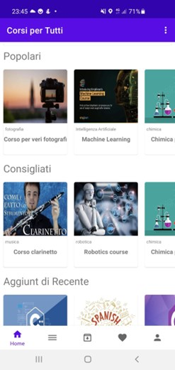

# Application for Accessing Online Courses
Smartphone application made for the exam of Mobile Programmi at Università Politecnica delle Marche.

Made by Matteo Giri, Lorenzo Tiseni, Andrea Camilloni

## Introduction
Starting from the specifications provided by the course instructor regarding an app for accessing online courses, we developed two applications based on real-time connection to Firebase
to manage user authentication and course access.

The first implementation, complete with all the requested features and additional functionalities, was developed on the Android platform using Kotlin. In this version, registered users can access
courses and interact by subscribing, adding to wishlist, reviewing the course, and accessing a forum.

In the second implementation, the application was developed on a cross-platform environment using Flutter. In this version, some functionalities were reduced, such as the ability to interact
in the forum with other users.

The general architecture of both applications is as follows:

- A login/registration page displayed at the first launch of the app; once the user registers with their data, the app remembers the login.
- After logging in, the user is shown the main interface of the application, where various courses are displayed, grouped according to popularity, suggested, and recently added. In the Android version,
a player was also added to resume the last interrupted lesson.
- Various sections were added, including a catalog where courses are divided by category and there is the possibility to filter by search, a page with subscribed courses, and a wishlist.
- A User Area was added to allow users to manage their data, including the ability to specify preferred categories and manage app theme settings.
- Opening a course allows the user to access a page containing course information. Through a dedicated subscription button, the user can enable hidden content, including notes, lessons,
and a forum (Forum: only in the Android version).

You can read the full report [here](<Relazione Programmazione Mobile.docx>) (in Italian).

